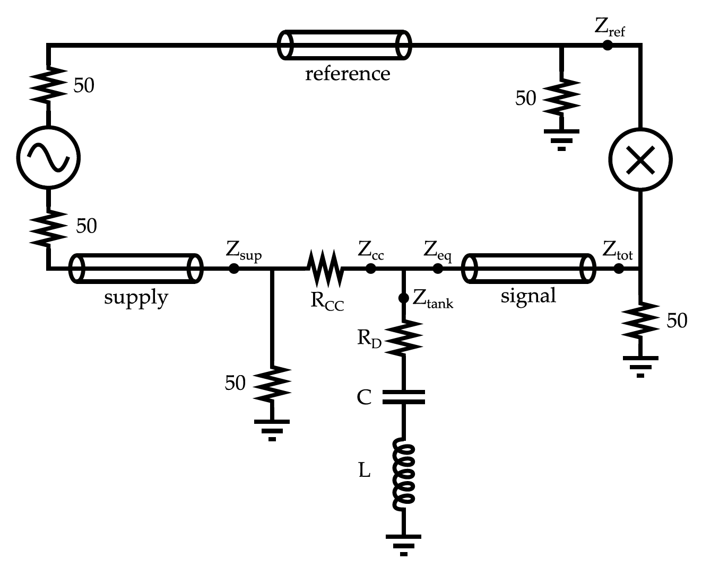

# QMeter Circuit Behavior Simulation Notebook

Jupyter Notebook representation of the electronic behavior of a series tank Q-meter. Based initially on MathCAD code by
M. Houlden, G. Court [[1]](#1). Expanded to include 4 additional transmission lines and test polarization signal. This is presented as is, which is a rough but working interactive notebook. 

### Installation
This code should be straightforward to run in a working Jupyter Notebook or Jupyter Lab installation. Mamba is the recommended way to do this:
* https://mamba.readthedocs.io/en/latest/installation/mamba-installation.html
* https://jupyterlab.readthedocs.io/en/4.2.x/getting_started/installation.html

The only dependencies are numpy, matplotlib and ipywidgets. They must be installed in your environment using pip.

### Usage

This notebook is heavily commented, which should help with use. The "controls" at the top are mostly overwritten when running interactively.

The code describes a series Q-meter circuit as seen in the figure below. It has the usual features of a standard Q-meter: 
* An RF source
* A reference line carrying the source directly to the mixer
* A supply line carrying the source to the tank circuit
* A series tank circuit with R, C, and L behind a constant current resistor Rcc
* A signal line connecting the tank to the other side of the mixer

In addition to the 3 transmission lines shown in the figure, there is a fourth on the series tank between the capacitor and inductor, commonly called the lambda/2 cable. Of the 4, the lambda/2 line has the largest effect on the output curve, but all contribute significantly, particularly when looking at small signals.

When the notebook cell is run, there are interactive controls which allow changing the most important aspects of the circuit. Four "trim" controls change the length of each transmission line: supply, signal, reference and coil (or lambda/2). These lengths are expressed in units of lambda/2. For instance, at 32 MHz, the lambda/2 length is 3.5 m, so setting the trim_sup to 1 sets the supply line to 3.5 m. 

The capacitance control is likewise expressed in units of the capacitance required to tune the bare tank to the Larmor frequency of the species with the given inductance. The Larmor frequency is calculated from the given species and the magnetic field, set in the code as a constant 5 T, which may be changed.

The phase control is set as degrees from ideal tune with zero line length. The sweep-range control changes the frequency range plotted and is in MHz.

There is an optional simulated signal to turn on to gauge the relative size and direction of a polarization signal as the circuit changes. This is somewhat realistic for protons, and uses approximations from Hill [[2]](#2) and values from Seely [[3]](#3). It enters as a multiplicative scale to the inductance.

## Author
Written in 2019 by J. Maxwell (https://orcid.org/0000-0003-2710-4646), [Jefferson Lab](https://www.jlab.org) Target Group.
## References

<a id="1">[1]</a> 
G.R. Court, M.A. Houlden, et. al. "High precision measurement of the polarization in solid state polarized targets
using NMR," NIM A 527 (2004) 253–263. (https://doi.org/10.1016/j.nima.2004.02.041)

<a id="2">[2]</a> 
J.J. Hill, D.A. Hill, "Simple correction for Q-meter measurement of proton target polarization," NIM 116 (1974) 269–274. (https://doi.org/10.1016/0029-554X(74)90613-2)

<a id="3">[3]</a> 
Seely, et. al. "Simulation and Tuning of the TUNL NMR System," Proceedings of the Workshop on NMR in Polarized Targets (1998) 